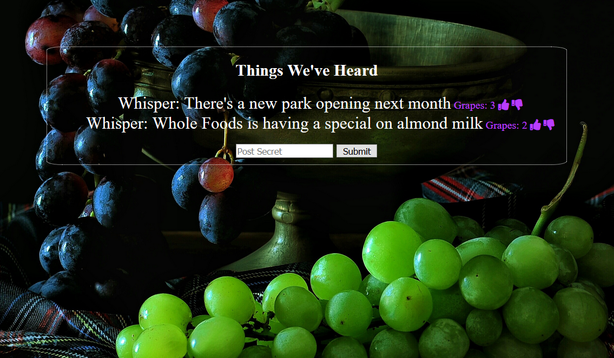

### GrapeVine
## Goal: Create an app that community can use to share information and also control what information is available

# How it's made:
- Set up server dependencies: express, mongodb, body-parser, ejs
- Set up a routes.js file that will handle all post, get, put, and delete requests to the database
- Create ejs page that loads all current comments in order of popularity, if any
- The only get request handler is for the main page load, it will load the entire collection from the database, sorted in reverse order of the scores so teh top scores are loaded first
- Post handler will take body of form and add it to the database collection with a score of 1
- Upvote and downvote icons are added to every comment that's loaded on the page
- Both icons have an event handler that can determine which of the two was clicked, it will send a put command to the server and will include in the body a new number that the score will be reassigned to
- If the new score is zero, a delete request is instead sent to the server for that comment

#How to run:
- clone this repo
- run npm install
- run node server.js
- navigate to localhost: 8000
